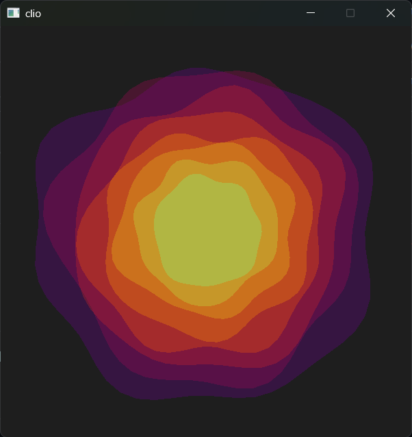

# Clio - A Music Visualizer

Named after the [Greek muse](https://en.wikipedia.org/wiki/Clio), Clio is a Music Visualizer written in C++ and [SDL3](https://github.com/libsdl-org/SDL). 
It is the result of about 3 Weeks worth of planning, coordination and implementation for a school project me and my colleague Engled worked on.

The goal of this project was to apply our skills in modelling and programming to a real application.

## Features

- **Media Controls** - Start and Pause as you'd expect 
- **Drag & Drop** - Just drag in any ``.wav`` file and it will play it for you
- **Debug View** - Tab changes the draw mode to leave out anything fancy
- **Performance** - consumes 7.2 MB of RAM on idle and only scales with the size of the input file

## Possible improvements

- **File streaming** - Only read parts of the ``.wav`` file to save RAM
- **More draw modes** - Add different ways to present the data
- **Custom DFT/FFT implementation** - Replace [dj_fft.h](https://github.com/jdupuy/dj_fft) with our own implementation